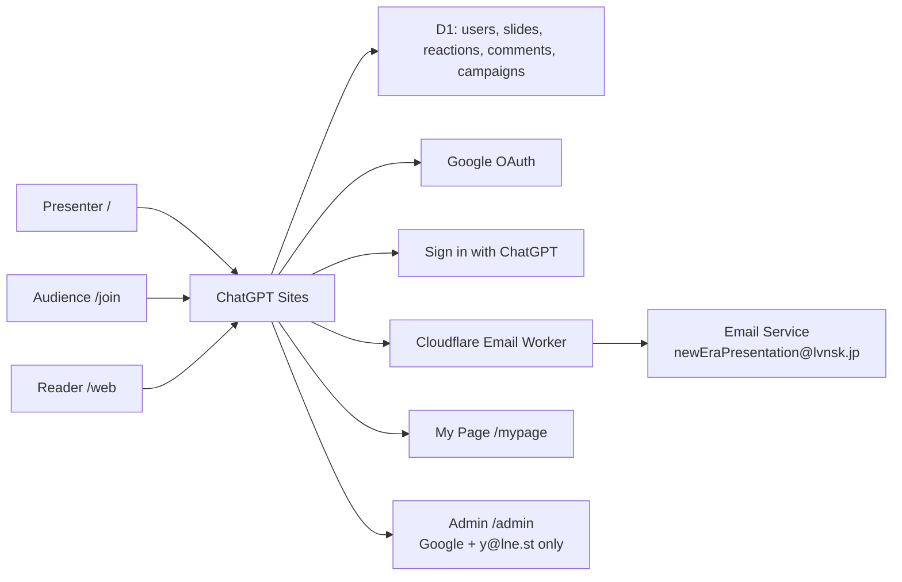

# New Era Presentation

**AI made slides fast. We make them human.**

[New Era Presentation](https://new-era-presentation.lvnsk.jp) is a live, participatory presentation medium built for **OpenAI Build Week 2026** with **Codex, GPT-5.6, and ChatGPT Sites**. The public source is available in the [Build Week repository](https://github.com/geeorgey/OpenAI-Build-Week-2026).

## Inspiration

AI made it dramatically easier to generate PowerPoint and Google Slides decks. It also created a new kind of audience fatigue: one-shot decks are presented almost untouched, so their structure, tone, and visual rhythm begin to feel mass-produced.

New Era Presentation is an antithesis to that pattern. It does not use AI to make more disposable slides. It uses AI to help a presenter and an audience make the same live moment together.

> The faster AI creates content, the more valuable human attention, editorial judgment, and live interaction become.

## What it does

- Presents a motion-rich, bilingual stage deck at `/`
- Offers a self-paced web version at `/web`
- Lets an audience join from a QR code at `/join`
- Supports guest, email, Google, and ChatGPT participation
- Marks email, Google, and ChatGPT identities as verified
- Anchors every stamp, comment, and question to the active slide
- Moves the conversation rail to the matching comment group when the slide changes
- Gives verified participants a personal reaction and comment history at `/mypage`
- Restricts `/admin` to the Google-verified email `y@lne.st`
- Lets the admin moderate comments and users, control public/password/private visibility, and send consent-based follow-up campaigns

## From a presentation to a relationship

Traditional presentation tools stop at lead capture. The presenter still has to reconstruct who cared about what and continue the relationship in another system.

This project stores consented interest signals on ChatGPT Sites: participation, verified identity, slide-linked comments, reactions, and marketing opt-in. The presenter can moderate the session, segment interest by theme, and send a follow-up without losing the context that created the relationship.

## How we built it

Codex and GPT-5.6 were used as one continuous build environment:

1. Turn the product thesis into a 17-scene narrative.
2. Design the stage, self-paced web mode, QR join surface, participant memory, and control room.
3. Implement routes, responsive motion, authentication boundaries, and slide-aware interaction.
4. Persist presentations, users, sessions, magic links, comments, reactions, and campaigns in Sites D1.
5. Use GPT Image 2 from Codex to create the project’s social image as part of the same visual system.
6. Extend Sites with a Cloudflare Email Service Worker, deployed through Codex’s `cloudflare-deploy` skill.
7. Build, test, publish, and verify the production experience from Codex.

### Architecture



### Routes

| Route | Purpose |
| --- | --- |
| `/` | Speaker-led presentation mode |
| `/web` | Self-paced public presentation |
| `/join` | Live audience participation and authentication |
| `/mypage` | Verified participant memory |
| `/admin` | Restricted moderation, access, and campaign control |
| `/privacy` | Privacy policy for participants and OAuth branding |
| `/terms` | Terms of use |

### Identity and trust

| Method | Verified badge | Notes |
| --- | --- | --- |
| Guest | No | Lowest-friction live participation |
| Email magic link | Yes | Delivered by the Cloudflare Email Worker |
| Google OAuth | Yes | Uses only `openid email profile` |
| Sign in with ChatGPT | Yes | Uses the dispatch-owned Sites sign-in flow |

Admin authorization is enforced server-side: the identity must be Google-verified and the normalized email must equal `y@lne.st`.

## Run locally

Prerequisite: Node.js `>=22.13.0`.

```bash
npm install
cp .env.example .env.local
npm run dev
```

Useful checks:

```bash
npm run lint
npm test
npm run db:generate

cd cloudflare-email-worker
npm install
npm run typecheck
```

## Environment variables

The Sites app uses:

```text
APP_BASE_URL
GOOGLE_CLIENT_ID
GOOGLE_CLIENT_SECRET
EMAIL_WORKER_URL
EMAIL_WORKER_SECRET
```

The Cloudflare Email Worker uses:

```text
APP_BASE_URL
WORKER_SHARED_SECRET
```

`EMAIL_WORKER_SECRET` and `WORKER_SHARED_SECRET` must contain the same high-entropy value. Never commit real credentials.

## Google OAuth setup

1. Create a Google Cloud project and configure **Google Auth Platform**.
2. Use an external audience and request only `openid`, `email`, and `profile`.
3. Add the production homepage, `/privacy`, and `/terms` URLs to the branding configuration.
4. Create a Web application OAuth client.
5. Add `${APP_BASE_URL}/auth/google/callback` as the exact authorized redirect URI.
6. Verify the custom domain in Google Search Console.

For a custom domain hosted on Sites, DNS TXT verification at the domain’s DNS provider is the reliable ownership proof. A verification file on a generated Sites hostname does not prove ownership of that parent domain.

## Cloudflare Email Service setup

The Worker in [`cloudflare-email-worker/`](cloudflare-email-worker/) sends email from `newEraPresentation@lvnsk.jp`.

1. Onboard `lvnsk.jp` to Cloudflare Email Service.
2. Confirm the requested SPF, DKIM, and DMARC DNS records.
3. Set `APP_BASE_URL` in `wrangler.jsonc`.
4. Store `WORKER_SHARED_SECRET` with `wrangler secret put`.
5. Deploy with `npm run deploy`.
6. Configure the resulting Worker URL and the matching secret in Sites.

Magic links expire after 15 minutes. Campaign mail includes consent language and one-click unsubscribe headers.

## Build Week scope and judging notes

The underlying observation came from building earlier presentation decks. This repository and its working implementation were created during the Build Week submission period. The new work includes the product narrative, 17-scene visual system, dual-mode deck, QR participation, D1 persistence, slide-linked interaction, four identity paths, participant memory, restricted admin control room, access modes, campaign workflow, Cloudflare email extension, tests, and production deployment.

The demo should show the real path in under three minutes:

`AI presentation fatigue → live QR join → stamp/comment → slide-linked conversation → personal memory → relationship follow-up → Codex + GPT-5.6 + Sites build`

Before submission, add the required Codex feedback session ID to the Devpost project and include a public demo video with audio.

## Why it matters

AI does not make presentation craft irrelevant. It raises the value of the choices only humans in the room can make: what deserves attention, when to pause, what question to pursue, and what relationship should continue afterward.

This project makes presentations worth joining and worth remembering.

## Security and privacy

- Secrets are supplied only through deployment environment variables.
- Session and magic-link tokens are stored as SHA-256 hashes.
- OAuth state is checked before token exchange.
- Admin authorization is enforced on both the page and API routes.
- Marketing delivery requires opt-in and supports unsubscribe.
- User content remains manageable through the restricted control room.

See [Privacy](https://new-era-presentation.lvnsk.jp/privacy) and [Terms](https://new-era-presentation.lvnsk.jp/terms).

## License

[MIT](LICENSE)
